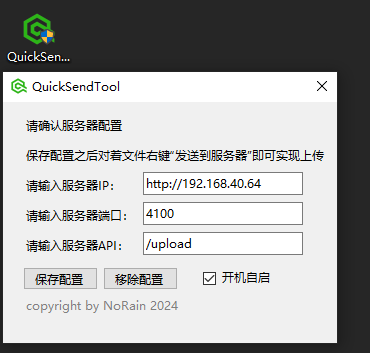

# QuickSendTool

## *by NoRain*

## 2024/7/9



|版本|说明|
|---|---|
|1.0.0|初版|
|1.1.0|添加开机自启，基本逻辑闭环|
|1.1.1|修复大文件卡死问题|
|1.2.0|微调，修复永远自动勾选开机自启的bug|
|1.3.0|修复第二次发送不显示UI问题|

可以把某个文件右键发送到特定http端口的小工具

以下是需求分析：

- [x] 需要写入注册表，也就是添加右键菜单功能
- [x] 以管理员身份运行
- [x] 右键选择发送之后，需要获取文件位置
- [x] 发送到特定的http服务器
- [x] 配置ip并且保存
- [x] 发送完成后弹出通知
- [x] 支持在后台运行加快速度
- [x] 通讯
- [x] 打包成exe
- [x] 解决大文件卡死问题

下面是一些技术总结/随堂小记

1，进程之间通讯可以消息管道，消息管道每次接收一次消息后自动回收，所以需要循环监听

2，管理员权限申请困难，不如简单一开始就申请。

3，win自带的压缩及其难受，需要建议自定义图标大小，256\*256，64\*64分辨率各一张，.png，.ico格式各一张，一共四张

4，UI操作只能在UI线程上进行，可以通过UI自动生成的上下文进行操作，即使生成状态栏图标也是存在UI上下文的。

5，<OutputType>Exe</OutputType> 会打包生成带命令行的exe程序，WinExe才是我们需要的。

6，win没有提供修改标题样式的API，建议自己模拟一个标题栏……

7,图标需要嵌入.exe，可以通过如下代码查看已经嵌入的资源

```cs
Assembly asm = Assembly.GetExecutingAssembly();
foreach (var resourceName in asm.GetManifestResourceNames())
{
    Console.WriteLine(resourceName);
}
assembly.GetManifestResourceStream(resourceName);
```

同时可以使用如下代码嵌入.cspoj

```xml
<EmbeddedResource Include="img\QucikSendTool.ico">
    <CopyToOutputDirectory>PreserveNewest</CopyToOutputDirectory>
</EmbeddedResource>
```

注意一点，```GetManifestResourceStream```中的命名空间是指程序的名字，而不是代码里边使用的命名空间……

8，.ico图标里边可以包含很多个分辨率，可以去[这个网站](https://cn.pic2ico.com/)在线转换，然后程序直接引用一个就够了

9，打包：```dotnet publish -c Release -r win10-x64 --self-contained false```

10，大量，频繁更新UI会导致UI卡死
